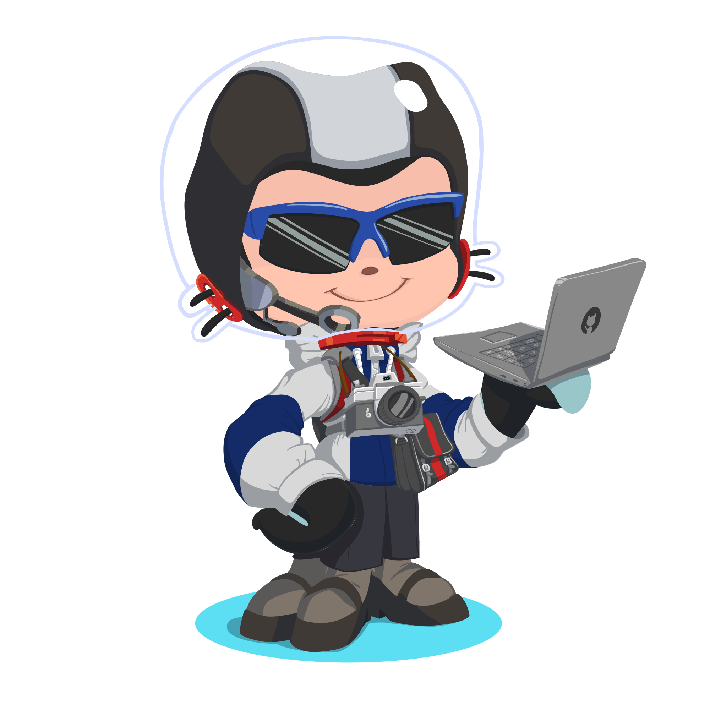

<div align="center">
  
</div>

<div align="center">
  <a href="https://git.io/typing-svg">
    
  </a>
</div>

<div align="center">
  
</div>

<p align="center">
  <a href="https://github.com/Kavi-ya?tab=repositories"></a>
  <a href="https://github.com/Kavi-ya?tab=followers"></a>
  <a href="https://github.com/Kavi-ya"></a>
</p>

<div align ="center">
<a href="https://gitroll.io/profile/ughywMoa7FgXHZtzc57gqoe8OcF62" target="_blank"></a>

  
  
</div>

##  About Me



```javascript
// const life = new Coding();
const profile = {
  name: "Kaviya",
  role: "Software Engineer",
  experience: "1+ years",
  languages: ["JavaScript", "TypeScript", "Python", "Java"],
  specialties: ["Full-Stack Development", "Cloud Architecture", "System Design"],
  current_focus: "Building scalable, web-oriented applications",
  education: {
    degree: "Undergraduate of CyberSecurity ",
    interests: ["AI/ML", "Cloud Systems", "Cyber-Security"]},  hobbies: ["Open Source"]};
```

<div align="center">
  <table>
    <tr>
      </td>
    </tr>
  </table>
</div>

##  Technologies & Tools

<p align="center">
  
  
  
  
  
  
  
</p>

<p align="center">
  
  
  
  
  
  
  
</p>

<p align="center">
  
  
  
  
  
  
  
</p>

<p align="center">
  
  
  
  
  
  
</p>

<p align="center">
  
  
  
  
  
</p>

<p align="center">
  
  
  
  
  
</p>

<div align="center">
  
</div>

<div align="center">
<a href="https://next.ossinsight.io/widgets/official/compose-user-dashboard-stats?user_id=83932877" target="_blank" style="display: block" align="center">
  <picture>
    <source media="(prefers-color-scheme: dark)" srcset="https://next.ossinsight.io/widgets/official/compose-user-dashboard-stats/thumbnail.png?user_id=83932877&image_size=auto&color_scheme=dark" width="771" height="auto">
    
  </picture>
</a>
</div>

<div align="center">
  <table>
    <tr>
      <td align="center">
        <a href="#">
          
        </a>
      </td>
      <td align="center">
        <a href="#">
          
        </a>
      </td>
      <td align="center">
        <a href="#">
          
        </a>
      </td>
    </tr>
    <tr>
      <td align="center">
        <a href="#">
          
        </a>
      </td>
      <td align="center">
        <a href="#">
          
        </a>
      </td>
      <td align="center">
        <a href="#">
          
        </a>
      </td>
    </tr>
  </table>

  <!-- Activity Graph -->
<br/>
<!-- Language Distribution Header -->
  <h2>
    
    Most Used Languages
  </h2>

  <!-- Large Language Card -->
  <a href="https://github.com/Kavi-ya">
    
  </a>
  <br/>
  <br/>
  
  

##  Featured Projects

<div align="center">
  <a href="https://github.com/Kavi-ya/Greenhouse-Automation">
    
  </a>
  <a href="https://github.com/Kavi-ya/Exam-Management-System">
    
  </a>
</div>

<div align="center">
  <a href="https://github.com/Kavi-ya?tab=repositories">
    
  </a>
</div>

<div align="center">
  
</div>

##  Connect With Me

<div align="center">
  <a href="https://linkedin.com/in/kavindu-sahan-silva/" target="https://www.linkedin.com/in/kavindu-sahan-silva/">
    
  </a>
  <a href="https://twitter.com/kaviya" target="_blank">
    
  </a>
  <a href="https://discord.gg/kaviya" target="_blank">
    
  </a>
  <a href="https://stackoverflow.com/users/12345678" target="_blank">
    
  </a>
  <a href="mailto:kavindusahansilva@gmail.com">
    
  </a>
</div>

<br>

<div align="center">
  <a href="https://www.buymeacoffee.com/kavi_ya" target="_blank">
    
  </a>
</div>

<div align="center">
  
</div>

<div align="center">
  <picture>
    <source media="(prefers-color-scheme: dark)" srcset="https://capsule-render.vercel.app/api?type=waving&section=footer&height=100&color=0:008bff,100:00c7ff">
    <source media="(prefers-color-scheme: light)" srcset="https://capsule-render.vercel.app/api?type=waving&section=footer&height=100&color=0:008bff,100:00c7ff">
    
  </picture>
</div>
